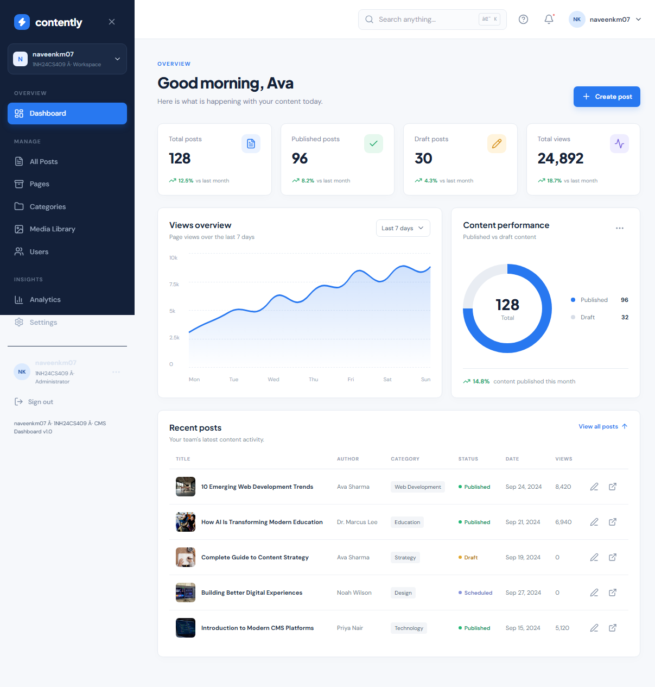

# Contently CMS Dashboard

Frontend-only CMS dashboard demo for `naveenkm07` (`1NH24CS409`), built with React, Vite, Tailwind CSS, and Lucide icons.

## Preview



The screenshot shows the working dashboard route with content metrics, the seven-day views chart, publishing performance, and recent posts.

## Codebase Analysis

- `src/main.jsx` contains the complete React application: routing, reusable layout components, mock content, forms, tables, charts, modals, notifications, and CRUD interactions.
- `src/styles.css` defines the responsive visual system, including the fixed desktop sidebar, mobile navigation, cards, tables, editor layout, charts, and settings views.
- `react-router-dom` provides routes for the dashboard, posts, pages, categories, media, users, analytics, and settings.
- `usePersisted` stores posts, categories, users, and settings in browser `localStorage`, so the demo keeps changes between refreshes without a backend.
- The project is intentionally frontend-only: all content is mock data and media uses remote Unsplash image URLs.

## Features

- Dashboard overview with content statistics, views chart, performance breakdown, and recent posts.
- Post creation and editing with draft/published states, filtering, sorting, and deletion.
- Page, category, media, and user management screens with modal forms and notifications.
- Analytics and workspace settings views.
- Responsive layout with a mobile sidebar and desktop navigation.

## Run Locally

```bash
npm install
npm run dev
```

Open the local Vite URL to view the dashboard. To create a production build:

```bash
npm run build
```

## Repository

[GitHub repository](https://github.com/Naveenkm007/fst-6)
